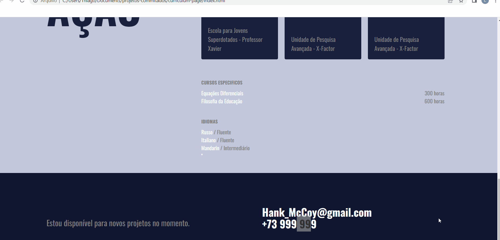

# Projeto Curricum Page 📄📄

Página desenvolvida para exercitar conceitos de CSS e HTML. O código foi orientado, em parte por intrutor 🙏 e posteriormente modificado por mim 😎.

## Tecnologias

- HTML
- CSS

